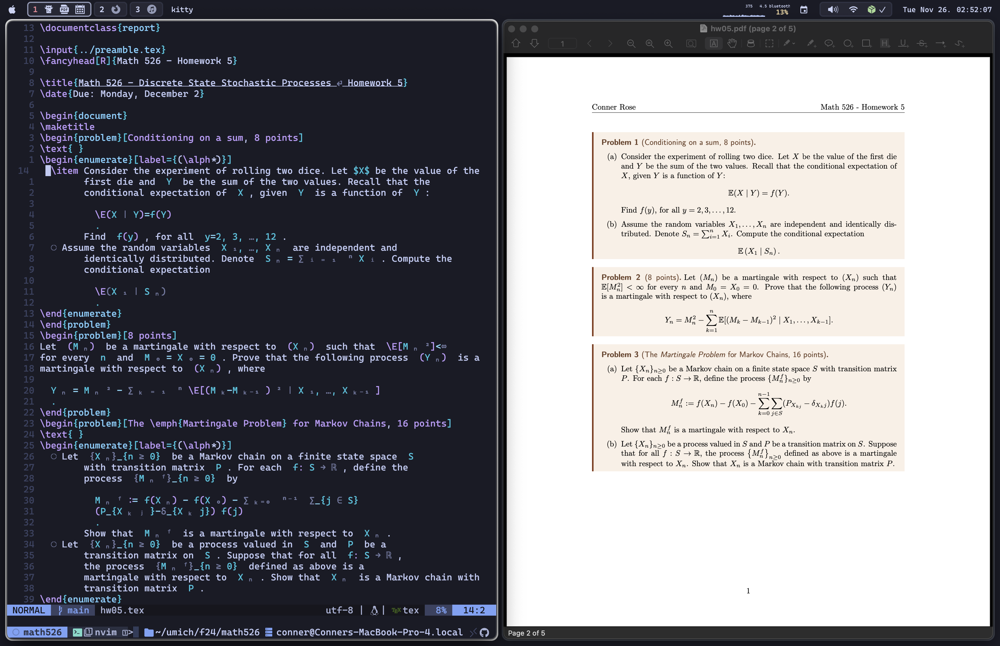

# My dotfiles

## Neovim

I stole most of my Neovim and tmux configurations from
[Dreams of Code's dotfiles](https://github.com/elliottminns/dotfiles).

This past semester, I used Neovim almost exclusively to write LaTeX
to complete my homework for my math and CS classes. Finding a better way
to write LaTeX than Overleaf or a VSCode extension is actually what got me
into using Neovim in the first place.

I took much inspiration from this
[YouTube video](https://www.youtube.com/watch?v=DOtM1mrWjUo)
and [blog post](https://castel.dev/post/lecture-notes-1), if you're interested
in how some of this works. Here's what it looks like:

